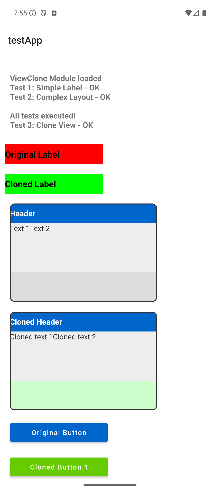
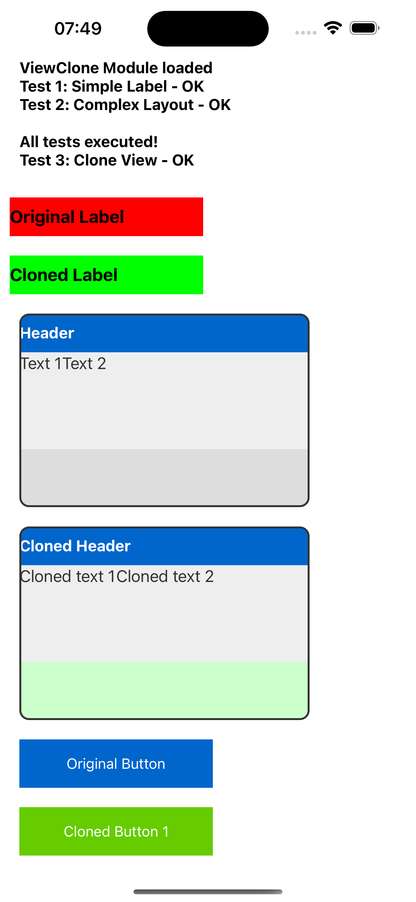

# ViewClone Module

## Description

The ViewClone module enables efficient deep cloning of Titanium UI Views with recursive copying of all child views and properties. Cloning happens natively on the Java (Android) or Objective-C (iOS) layer for maximum performance.

Unlike the SDK's built-in clone mechanism, which shares the same JavaScript wrapper between original and clone, ViewClone creates a truly independent clone with its own JavaScript identity.

## Features

- **Recursive cloning**: Copies complex view hierarchies in full depth
- **Property copy**: All Titanium properties are preserved
- **Native performance**: Cloning executes on the native layer for fast operation
- **Cross-platform**: Supports both Android and iOS
- **Compatibility**: Supports all Ti.UI.View types (View, Label, Button, ImageView, etc.)
- **Independent identity**: Each clone gets its own JS wrapper — no shared state with the original

## Accessing the ViewClone Module

To use the module in JavaScript:

```javascript
import viewclone from 'de.marcbender.viewclone';
// or
var viewclone = require('de.marcbender.viewclone');
```

## Reference

### viewclone.cloneView(view)

Clones a TiViewProxy instance with all properties and child views. Child views are cloned recursively.

#### Arguments

| Name | Type | Description |
|------|------|-------------|
| view | TiViewProxy | The view proxy to clone |

#### Returns

TiViewProxy — A new independent view proxy, or `null` if cloning fails.

#### What gets cloned

- All properties (positioning, styling, layout, fonts, colors, etc.)
- Child views — recursively cloned and added to the cloned parent
- The view type (`apiName`) — the clone is the same Ti.UI type as the original

#### What does NOT get cloned

- Event listeners — add new listeners to the clone as needed

#### Example

```javascript
const originalView = Ti.UI.createView({
    backgroundColor: 'red',
    width: 100,
    height: 100
});

const clonedView = viewclone.cloneView(originalView);
clonedView.backgroundColor = 'blue';
win.add(clonedView);
```

#### Complex View Example

```javascript
// Create a complex layout with child views
const container = Ti.UI.createView({
    layout: 'vertical',
    backgroundColor: '#eee',
    width: 300,
    height: 200
});

const header = Ti.UI.createLabel({
    text: 'Header',
    backgroundColor: '#0066cc',
    color: '#fff',
    width: Ti.UI.FILL,
    height: 40
});

const content = Ti.UI.createLabel({
    text: 'Content',
    color: '#333',
    width: Ti.UI.FILL,
    height: Ti.UI.FILL
});

container.add(header);
container.add(content);
win.add(container);

// Clone the entire layout
const clonedContainer = viewclone.cloneView(container);
clonedContainer.top = 250;

// Access cloned children via the .children property
const children = clonedContainer.children;
if (children && children.length > 0) {
    children[0].text = 'Cloned Header';
}

win.add(clonedContainer);
```

## Usage

### Simple cloning

```javascript
import viewclone from 'de.marcbender.viewclone';

const original = Ti.UI.createLabel({
    text: 'Hello World',
    color: '#000',
    font: { fontSize: 16 }
});

const clone = viewclone.cloneView(original);
clone.text = 'Cloned Text';
```

### Recursive cloning with child views

The module automatically clones all child views recursively:

```javascript
const parent = Ti.UI.createView({
    layout: 'vertical'
});

const child1 = Ti.UI.createLabel({ text: 'Child 1' });
const child2 = Ti.UI.createLabel({ text: 'Child 2' });

parent.add(child1);
parent.add(child2);

// Cloning also clones child1 and child2
const clonedParent = viewclone.cloneView(parent);
```

### Event listener handling

Event listeners are **not** cloned. Add your own listeners to the clone after cloning:

```javascript
const button = Ti.UI.createButton({ title: 'Click me' });

button.addEventListener('click', function(e) {
    console.log('Original clicked');
});

const clonedButton = viewclone.cloneView(button);

// Add a new listener to the clone
clonedButton.addEventListener('click', function(e) {
    console.log('Cloned clicked');
});
```

### Accessing cloned children

Use the `.children` property to access child views of a cloned view. Do **not** use `.getChildren()` — it is not available on cloned views because `children` is exposed as a JavaScript property via `@Kroll.getProperty`, not as a callable method.

```javascript
const clonedView = viewclone.cloneView(parentView);

// Correct
const children = clonedView.children;

// Incorrect — not available on cloned views
const children = clonedView.getChildren();
```

### Native view properties

Properties like `rect` and `size` may return zero values immediately after cloning. The native view is created lazily when the proxy is added to a visible window. Actual values are populated once the view is rendered.

## Screenshots

### Android



### iOS



## Author

**Marc Bender**

## License

Apache Public License